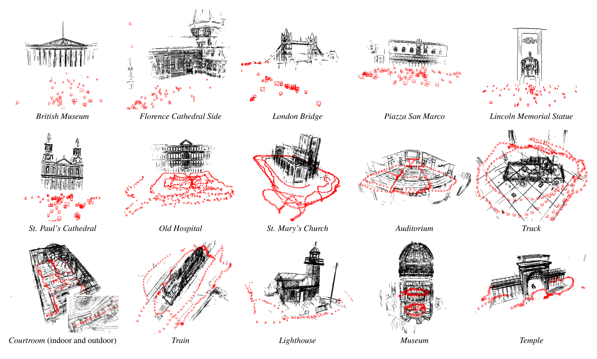

# LIMAP 

**The documentations on brief tutorials and APIs are available [here](http://b1ueber2y.me/projects/LIMAP/docs/)**.

<p align="center">

</p>

LIMAP is a toolbox for mapping and localization with line features. The system was initially described in the highlight paper [3D Line Mapping Revisited](https://arxiv.org/abs/2303.17504) at CVPR 2023 in Vancouver, Canada. Contributors to this project are from the [Computer Vision and Geometry Group](https://cvg.ethz.ch/) at [ETH Zurich](https://ethz.ch/en.html).

In this project, we provide interfaces for various geometric operations on 2D/3D lines. We support off-the-shelf SfM software including [VisualSfM](http://ccwu.me/vsfm/index.html), [Bundler](https://bundler.io/), and [COLMAP](https://colmap.github.io/) to initialize the camera poses to build 3D line maps on the database. The line detectors, matchers, and vanishing point estimators are abstracted to ensure flexibility to support recent advances and future development. 

**Next step:** Hybrid incremental SfM is under development and will be included in the next round of release.

<p align="center">

</p>

## Installation

**Install the dependencies as follows:**
* Python 3.8/9/10
* CMake >= 3.17
* CUDA (for deep learning based detectors/matchers)
* System dependencies [[Command line](./misc/install/dependencies.md)]

To install the LIMAP Python package:
```
git submodule update --init --recursive
python -m pip install -r requirements.txt
python -m pip install -Ive . 
```
To double check if the package is successfully installed:
```
python -c "import limap; print(limap.__version__)"
```

## Quickstart

### Example of Line Mapping
Download the test scene **(100 images)** with the following command.
```bash
bash scripts/quickstart.sh
```

To run **Fitnmerge** (line mapping with available depth maps) on Hypersim (visualization is enabled by default):
```bash
python runners/hypersim/fitnmerge.py --output_dir outputs/quickstart_fitnmerge
```

To run **Line Mapping** (RGB-only) on Hypersim (visualization is enabled by default):
```bash
python runners/hypersim/triangulation.py --output_dir outputs/quickstart_triangulation
```
To run **Visualization** of the 3D line maps after the reconstruction:
```bash
python visualize_3d_lines.py --input_dir outputs/quickstart_triangulation/finaltracks # add the camera frustums with "--imagecols outputs/quickstart_triangulation/imagecols.npy"
```

[Tips] Options are stored in the config folder: ``cfgs``. You can easily change the options with the Python argument parser. The following shows an example:
```bash
python runners/hypersim/triangulation.py --sfm.hloc.descriptor sift --line2d.detector.method lsd \
                                         --line2d.visualize --triangulation.IoU_threshold 0.2 \
                                         --skip_exists --n_visible_views 5
```
In particular, ``--skip_exists`` is a very useful option to avoid running point-based SfM and line detection/description repeatedly in each pass. 

Also, the combination  ``LSD detector + Endpoints NN matcher`` can be enabled with ``--default_config_file cfgs/triangulation/default_fast.yaml`` for high efficiency (while with non-negligible performance degradation).

### Example of Hybrid Point-Line Localization
We provide two query examples for localization from the *Stairs* scene in the [7Scenes](https://www.microsoft.com/en-us/research/project/rgb-d-dataset-7-scenes/) Dataset, where traditional point-based methods normally struggle due to the repeated steps and lack of texture. The examples are provided in `.npy` files: `runners/tests/data/localization/localization_test_data_stairs_[1|2].npy`, which contains the necessary 2D-3D point and line correspondences along with the necessary configurations.

To run the examples, for instance the first one:
```bash
python runners/tests/localization.py --data runners/tests/data/localization/localization_test_data_stairs_1.npy
```

The script will print the pose error estimated using point-only (hloc), and the pose error estimated by our hybrid point-line localization framework. In addition, two images will be created in the output folder (default to `outputs/test/localization`) showing the inliers point and line correspondences in hybrid localization projected using the two estimated camera pose (by point-only and point+line) onto the query image with 2D point and line detections marked. An improved accuracy of the hybrid point-line method is expected to be observed.

## Supported line detectors, matchers and VP estimators

If you wish to use the methods with **separate installation needed** you need to install it yourself with the corresponding guides. This is to avoid potential issues at the LIMAP installation to ensure a quicker start.

**Note**: PR on integration of new features are very welcome.

**The following line detectors are currently supported:**
- [LSD](https://github.com/iago-suarez/pytlsd)
- [SOLD2](https://github.com/cvg/SOLD2)
- [HAWP](https://github.com/cherubicXN/hawp) (separate installation needed [[Guide](misc/install/hawpv3.md)])
- [TP-LSD](https://github.com/Siyuada7/TP-LSD) (separate installation needed [[Guide](misc/install/tp_lsd.md)]) 
- [DeepLSD](https://github.com/cvg/DeepLSD)

**The following line descriptors/matchers are currently supported:**
- [LBD](https://github.com/iago-suarez/pytlbd) (separate installation needed [[Guide](misc/install/lbd.md)])
- [SOLD2](https://github.com/cvg/SOLD2)
- [LineTR](https://github.com/yosungho/LineTR)
- [L2D2](https://github.com/hichem-abdellali/L2D2)
- Endpoint matching with [SuperPoint](https://github.com/magicleap/SuperPointPretrainedNetwork) + Nearest Neighbors
- Endpoint matching with [SuperPoint](https://github.com/magicleap/SuperPointPretrainedNetwork) + [SuperGlue](https://github.com/magicleap/SuperGluePretrainedNetwork)
- [GlueStick](https://github.com/cvg/GlueStick)

**The following vanishing point estimators are currently supported:**
- [JLinkage](https://github.com/B1ueber2y/JLinkage)
- [Progressive-X](https://github.com/danini/progressive-x) (separation installation needed [[Guide](https://github.com/danini/progressive-x/blob/master/README.md)])

## Citation
If you use this code in your project, please consider citing the following paper:
```bibtex
@InProceedings{Liu_2023_LIMAP,
    author = {Liu, Shaohui and Yu, Yifan and Pautrat, Rémi and Pollefeys, Marc and Larsson, Viktor},
    title = {3D Line Mapping Revisited},
    booktitle = {Computer Vision and Pattern Recognition (CVPR)},
    year = {2023},
}
```

## Contributors
This project is mainly developed and maintained by [Shaohui Liu](https://github.com/B1ueber2y/), [Yifan Yu](https://github.com/MarkYu98), [Rémi Pautrat](https://github.com/rpautrat), and [Viktor Larsson](https://github.com/vlarsson). Issues and contributions are very welcome at any time. 

