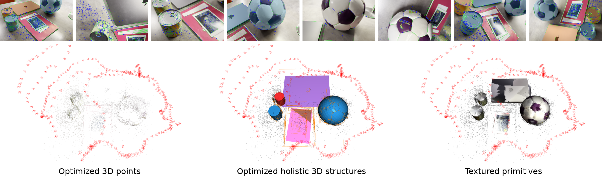

# LIMAP 

**The documentations on brief tutorials and APIs are available [here](https://b1ueber2y.me/projects/LIMAP/docs/index.html)**.

<p align="center">

</p>

LIMAP is a toolbox for holistic 3D mapping, localization and structure from motion (SfM) with structured features. Alongside keypoints, it treats **lines**, **vanishing points**, **planes**, **parametric primitives** (spheres, cylinders, ellipsoids, cuboids, cones) and the **wireframe** connecting them as first-class citizens of the reconstruction, optimized jointly with the camera poses. It grew out of the highlight paper [3D Line Mapping Revisited](https://arxiv.org/abs/2303.17504) at CVPR 2023 in Vancouver, Canada, with the SfM pipeline introduced and further improved in subsequent papers at [ECCV 2024](https://arxiv.org/abs/2409.19811) and ECCV 2026 (please refer to the [Citation](#citation) section for details). Contributors to this project are from the [Computer Vision and Geometry Group](https://cvg.ethz.ch/) at [ETH Zurich](https://ethz.ch/en.html).

Three pipelines are provided:

* **Visual mapping / triangulation** — build a holistic 3D model from images whose camera poses are already known, for instance from an existing [COLMAP](https://colmap.github.io/) reconstruction.
* **Visual localization** — estimate the camera pose of a query image with respect to an existing 3D model, using point and line correspondences jointly. Both calibrated and uncalibrated queries are supported.
* **Holistic incremental SfM** — recover the camera poses and the 3D model together from images alone, with nothing given as input. Calibrated and uncalibrated inputs are both supported.

> [!NOTE]
> **Starting from LIMAP 2.0.0, the toolbox is fully compatible with the COLMAP ecosystem** (version 4.2.0 as of Sep 1, 2026): a reconstruction is written as a plain COLMAP model, with the line, group and wireframe structures alongside it under `structures/`, so any output can be opened in COLMAP GUI and read with `pycolmap`. The unification runs deeper than the file format: the point side of the pipeline comes directly from COLMAP, consolidating with its scene types, database, estimators, correspondence graph, and various incremental mapper logic, with LIMAP adding the structures on top instead of maintaining a parallel implementation. Advances on the COLMAP side therefore carry over directly: multi-camera rig support, improved two-view geometry estimation, etc.

The line detectors, matchers, vanishing point estimators and plane detectors are abstracted behind registries to ensure flexibility to support recent advances and future development.

<p align="center">

</p>

<p align="center">

</p>

<p align="center"><i>From multi-view images, LIMAP jointly optimizes the features, the camera poses and the structural constraints.<br>
This yields a sparse 3D reconstruction with geometric primitives (planes, spheres, cylinders) beyond point clouds.</i></p>

## Installation

**Install the dependencies as follows:**
* Python 3.10/11/12
* CMake >= 3.17
* CUDA (for deep learning based detectors/matchers)
* System dependencies [[Command line](./misc/install/dependencies.md)]

To install the LIMAP Python package:
```
git submodule update --init --recursive
python -m pip install -r requirements.txt
python -m pip install -Ive . 
```
To double check if the package is successfully installed:
```
python -c "import limap; print(limap.__version__)"
```

For faster incremental rebuilds during development (reuses the CMake build
directory instead of rebuilding from scratch):
```
python -m pip install -Cbuild-dir=./pylimap_build --no-build-isolation -Ive .
```

### Potential troubleshooting: conflicting Intel MKL installations

If bundle adjustment aborts with `Intel MKL FATAL ERROR: Cannot load libmkl_avx2.so or libmkl_def.so`, `_limap.so` is resolving to an inconsistent system MKL. Point the extension at a coherent one (`${CONDA_PREFIX}/lib`, or any directory holding a consistent MKL):
```bash
python -m pip install patchelf
LIMAP_SO=$(python -c 'import limap._limap as m; print(m.__file__)')
patchelf --set-rpath "${CONDA_PREFIX}/lib" "$LIMAP_SO"
ldd "$LIMAP_SO" | grep mkl   # none should resolve to /lib/x86_64-linux-gnu
```
Re-apply after rebuilding. Prefer this to putting the directory on `LD_LIBRARY_PATH`, which affects every program in the shell.

## Quickstart

### Example of Point-Line Triangulation
Download the test scene **(100 images)** with the following command.
```bash
bash scripts/quickstart.sh
```

**Step 1: Undistort images to pinhole cameras**

First, prepare the Hypersim scene by undistorting images and creating a COLMAP model:
```bash
python runners/hypersim/undistort_images.py \
    --data_dir data \
    --scene_id ai_001_001 \
    --output_dir outputs/quickstart \
    --max_image_dim 800
```

This creates:
- `outputs/quickstart/init_model/` - Initial COLMAP model
- `outputs/quickstart/undistorted/images/` - Undistorted images
- `outputs/quickstart/undistorted/sparse/` - Undistorted COLMAP model

**Step 2: Run point-line triangulation**

Then, run point-line triangulation on the undistorted images:
```bash
python -m limap.cli.automatic_point_line_triangulation \
    -m outputs/quickstart/undistorted/sparse \
    -i outputs/quickstart/undistorted/images \
    -o outputs/quickstart/triangulation
```

**Visualization**

To visualize the full reconstruction (points + lines):
```bash
python visualize_holistic_recon.py --input_dir outputs/quickstart/triangulation/final_model --cam_scale 0.1
```

To visualize points only (using pycolmap):
```bash
python visualize_colmap_model.py --input_dir outputs/quickstart/triangulation/final_model --cam_scale 0.1
```

### Example of Hybrid Point-Line Localization
We provide an example of hybrid point-line localization on the *Stairs* scene of the [7Scenes](https://www.microsoft.com/en-us/research/project/rgb-d-dataset-7-scenes/) dataset.

Prepare the dataset following the hloc [7Scenes pipeline](https://github.com/cvg/Hierarchical-Localization/tree/master/hloc/pipelines/7Scenes) (scene images together with the SIFT SfM models, DenseVLAD retrieval pairs, and rendered depth maps), laid out under a single `datasets/7scenes` root. Then run:
```bash
python runners/7scenes/localization.py --dataset datasets/7scenes -s stairs --skip_exists
```

Add `--use_dense_depth` to build the line map from rendered depth maps instead of triangulation, or `--use_points_only` for the point-only baseline. The runner prints the pose errors for point-only (hloc) versus hybrid point-line localization; an improved accuracy from adding lines is expected.

We also support localization without knowing the query intrinsics, by adding the `--uncalibrated` flag:
```bash
python runners/7scenes/localization.py --dataset datasets/7scenes -s stairs --skip_exists --uncalibrated
```
The focal length is then estimated jointly with the pose from the same point and line correspondences. Lines give a consistent improvement here, both on the pose and on the consistency of the recovered focal length across queries.

### Example of Holistic Incremental SfM

The same test scene can be reconstructed from scratch (no input poses) with the
holistic incremental mapper, which jointly optimizes points, lines,
vanishing points, planes and the wireframe:
```bash
python experiments/benchmark_sfm.py \
    --dataset hypersim \
    --scenes ai_001_001 \
    --data_dir data \
    --output_dir outputs/quickstart_sfm
```

This writes `outputs/quickstart_sfm/hypersim/ai_001_001/holistic/models/` and
prints relative pose AUC against the ground-truth poses. Add
`--methods holistic pycolmap` to run the COLMAP mapper alongside it on the
same features and matches.

We also support structure from motion without knowing the intrinsics, by adding the `--uncalibrated` flag:
```bash
python experiments/benchmark_sfm.py \
    --dataset hypersim \
    --scenes ai_001_001 \
    --data_dir data \
    --output_dir outputs/quickstart_sfm_uncalibrated \
    --uncalibrated
```

Nominal relative pose AUC over five runs on this quickstart scene:

|                               | AUC@0.25   | AUC@0.5    | AUC@1      | AUC@3      | AUC@5      |
| ----------------------------- | ---------- | ---------- | ---------- | ---------- | ---------- |
| COLMAP, calibrated            | 33.7 ± 1.5 | 69.2 ± 0.4 | 85.5 ± 0.3 | 93.1 ± 0.1 | 93.7 ± 0.1 |
| Holistic (ours), calibrated   | 51.6 ± 2.4 | 81.5 ± 2.2 | 92.0 ± 2.4 | 97.6 ± 0.2 | 97.9 ± 0.1 |
| COLMAP, uncalibrated          | 31.8 ± 1.4 | 65.4 ± 5.8 | 81.7 ± 7.6 | 89.8 ± 8.1 | 90.5 ± 8.2 |
| Holistic (ours), uncalibrated | 50.1 ± 3.4 | 80.7 ± 1.6 | 92.7 ± 1.4 | 97.6 ± 0.1 | 97.9 ± 0.0 |

Other datasets are selected with `--dataset {hypersim,scannetpp,eth3d,7scenes,1dsfm}`,
each read directly from its own release via `--data_dir`.

## Supported line detectors, matchers, VP and plane estimators

If you wish to use the methods with **separate installation needed** you need to install it yourself with the corresponding guides. This is to avoid potential issues at the LIMAP installation to ensure a quicker start.

**Note**: PR on integration of new features are very welcome.

**The following line detectors are currently supported:**
- [LSD](https://github.com/iago-suarez/pytlsd)
- [SOLD2](https://github.com/cvg/SOLD2)
- [HAWP](https://github.com/cherubicXN/hawp) (separate installation needed [[Guide](misc/install/hawpv3.md)])
- [TP-LSD](https://github.com/Siyuada7/TP-LSD) (separate installation needed [[Guide](misc/install/tp_lsd.md)]) 
- [DeepLSD](https://github.com/cvg/DeepLSD)

**The following line descriptors/matchers are currently supported:**
- [LBD](https://github.com/iago-suarez/pytlbd) (separate installation needed [[Guide](misc/install/lbd.md)])
- [SOLD2](https://github.com/cvg/SOLD2)
- [LineTR](https://github.com/yosungho/LineTR)
- [L2D2](https://github.com/hichem-abdellali/L2D2)
- Endpoint matching with [SuperPoint](https://github.com/magicleap/SuperPointPretrainedNetwork) + Nearest Neighbors
- Endpoint matching with [SuperPoint](https://github.com/magicleap/SuperPointPretrainedNetwork) + [SuperGlue](https://github.com/magicleap/SuperGluePretrainedNetwork)
- [GlueStick](https://github.com/cvg/GlueStick)
- Custom line matcher based on dense matcher [RoMa](https://github.com/Parskatt/RoMa) (separate installation needed [[Guide](misc/install/roma.md)])

**The following vanishing point estimators are currently supported:**
- [JLinkage](https://github.com/B1ueber2y/JLinkage)
- [Progressive-X](https://github.com/danini/progressive-x) (separation installation needed [[Guide](https://github.com/danini/progressive-x/blob/master/README.md)])

**The following plane detectors are currently supported:**
- [PxwPlanar](https://github.com/alpayozkan/PixelwisePlanarity) - monocular plane segmentation from a 4-head MoGe-2 backbone (planarity, metric depth, normals and mask) followed by GPU-accelerated region growing (ECCV 2026)

No separate installation is needed: `pxwplanar` is pulled in by `requirements.txt` and its weights download from Hugging Face on first use. It does require the MoGe fork that `pxwplanar` pins; another MoGe install in the same environment will shadow it and break metric prediction on CUDA.

## Citation
If you use this code in your project, please consider citing the following paper:
```bibtex
@InProceedings{Liu_2023_LIMAP,
    author = {Liu, Shaohui and Yu, Yifan and Pautrat, Rémi and Pollefeys, Marc and Larsson, Viktor},
    title = {3D Line Mapping Revisited},
    booktitle = {Computer Vision and Pattern Recognition (CVPR)},
    year = {2023},
}
```

If you use the holistic incremental SfM pipeline, please consider additionally citing:
```bibtex
@InProceedings{Liu_2024_Robust,
    author = {Liu, Shaohui and Gao, Yidan and Zhang, Tianyi and Pautrat, Rémi and Schönberger, Johannes L. and Larsson, Viktor and Pollefeys, Marc},
    title = {Robust Incremental Structure-from-Motion with Hybrid Features},
    booktitle = {European Conference on Computer Vision (ECCV)},
    year = {2024},
}

@InProceedings{Liu_2026_Stable,
    author = {Liu, Shaohui and Pautrat, Rémi and Barath, Daniel and Hartley, Richard and Larsson, Viktor and Pollefeys, Marc},
    title = {Stable and Scalable Bundle Adjustment of Holistic 3D Structures},
    booktitle = {European Conference on Computer Vision (ECCV)},
    year = {2026},
}
```

## Contributors
This project is mainly developed and maintained by [Shaohui Liu](https://github.com/B1ueber2y/), [Yifan Yu](https://github.com/MarkYu98), [Rémi Pautrat](https://github.com/rpautrat), and [Viktor Larsson](https://github.com/vlarsson). Issues and contributions are very welcome at any time. 

