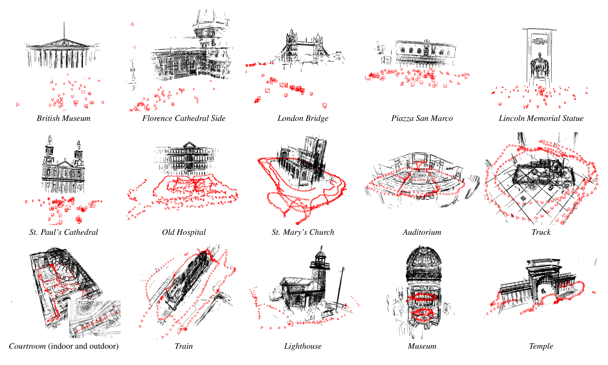

.. LIMAP documentation master file, created by
   sphinx-quickstart on Fri Mar 24 12:35:33 2023.
   You can adapt this file completely to your liking, but it should at least
   contain the root `toctree` directive.

Welcome to LIMAP's documentation!
=================================

LIMAP is a toolbox for mapping and localization with line features. The system was initially described in the highlight paper `3D Line Mapping Revisited <https://arxiv.org/abs/2303.17504>`_ at CVPR 2023 in Vancouver, Canada. Contributors to this project are from the `Computer Vision and Geometry Group <https://cvg.ethz.ch>`_ at `ETH Zurich <https://ethz.ch/en.html>`_.

In this project, we provide interfaces for various geometric operations on 2D/3D lines. We support off-the-shelf SfM software including `VisualSfM <http://ccwu.me/vsfm/index.html>`_, `Bundler <https://bundler.io/>`_, and `COLMAP <https://colmap.github.io/>`_ to initialize the camera poses to build 3D line maps on the database. The line detectors, matchers, and vanishing point estimators are abstracted to ensure flexibility to support recent advances and future development. 

.. toctree::
   :maxdepth: 1
   :caption: Tutorials: 

   tutorials/installation
   tutorials/quickstart
   tutorials/line2d
   tutorials/triangulation
   tutorials/localization
   tutorials/visualization

.. toctree::
   :maxdepth: 2
   :caption: API references: 

   api/limap.base
   api/limap.line2d
   api/limap.estimators
   api/limap.evaluation
   api/limap.runners
   api/limap.triangulation
   api/limap.undistortion
   api/limap.visualize
   api/limap.vplib

.. toctree::
   :maxdepth: 1
   :caption: Community: 

   developers

