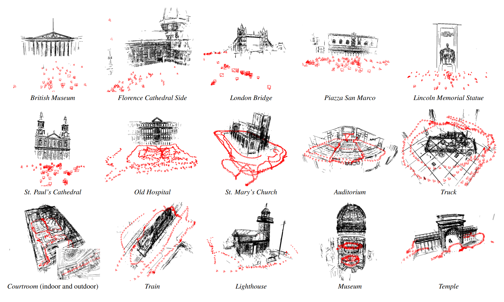

.. LIMAP documentation master file, created by
   sphinx-quickstart on Fri Mar 24 12:35:33 2023.
   You can adapt this file completely to your liking, but it should at least
   contain the root `toctree` directive.

Welcome to LIMAP's documentation!
=================================

LIMAP is a toolbox for holistic 3D mapping, localization and structure from motion (SfM) with structured features. Alongside keypoints, it treats **lines**, **vanishing points**, **planes**, **parametric primitives** (spheres, cylinders, ellipsoids, cuboids, cones) and the **wireframe** connecting them as first-class citizens of the reconstruction, optimized jointly with the camera poses. It grew out of the highlight paper `3D Line Mapping Revisited <https://arxiv.org/abs/2303.17504>`_ at CVPR 2023 in Vancouver, Canada, with the SfM pipeline introduced and further improved in subsequent papers at `ECCV 2024 <https://arxiv.org/abs/2409.19811>`_ and ECCV 2026. Contributors to this project are from the `Computer Vision and Geometry Group <https://cvg.ethz.ch>`_ at `ETH Zurich <https://ethz.ch/en.html>`_.

Three pipelines are provided:

* **Visual mapping / triangulation** -- build a holistic 3D model from images whose camera poses are already known, for instance from an existing `COLMAP <https://colmap.github.io/>`_ reconstruction.
* **Visual localization** -- estimate the camera pose of a query image with respect to an existing 3D model, using point and line correspondences jointly.
* **Holistic incremental SfM** -- recover the camera poses and the 3D model together from images alone, with nothing given as input.

.. note::

   **Starting from LIMAP 2.0.0, the toolbox is fully compatible with the COLMAP ecosystem** (version 4.2.0 as of Sep 1, 2026): a reconstruction is written as a plain COLMAP model, with the line, group and wireframe structures alongside it under ``structures/``, so any output can be opened in COLMAP GUI and read with ``pycolmap``. The unification runs deeper than the file format: the point side of the pipeline comes directly from COLMAP, consolidating with its scene types, database, estimators, correspondence graph, and various incremental mapper logic, with LIMAP adding the structures on top instead of maintaining a parallel implementation. Advances on the COLMAP side therefore carry over directly: multi-camera rig support, improved two-view geometry estimation, etc.

The line detectors, matchers, vanishing point estimators and plane detectors are abstracted behind registries to ensure flexibility to support recent advances and future development.

.. image:: media/teaser_holistic.png

.. rst-class:: caption

   | *From multi-view images, LIMAP jointly optimizes the features, the camera poses and the structural constraints.*
   | *This yields a sparse 3D reconstruction with geometric primitives (planes, spheres, cylinders) beyond point clouds.*

.. toctree::
   :maxdepth: 1
   :caption: Tutorials:

   tutorials/installation
   tutorials/quickstart
   tutorials/line2d
   tutorials/groups
   tutorials/triangulation
   tutorials/sfm
   tutorials/output
   tutorials/localization
   tutorials/visualization

.. toctree::
   :maxdepth: 2
   :caption: API references:

   api/limap.geometry
   api/limap.image
   api/limap.scene
   api/limap.sfm
   api/limap.estimators
   api/limap.evaluation
   api/limap.runners
   api/limap.visualize

.. toctree::
   :maxdepth: 1
   :caption: Community:

   developers
